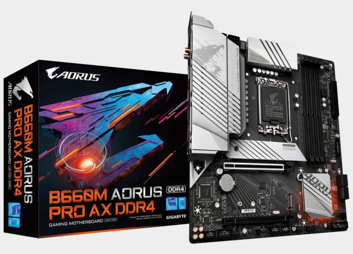

# Gigabyte Aorus Pro DDR4 Hackintosh

  

  
* macOS:
- Montery 12.6 
* Bootloader: OpenCore

  
based on [taruyato EFI](https://github.com/taruyato/b660m-aorus-pro-hackintosh) follow and read this link first.

## System Overview

  
| Type | Item |

| ---- | ---- |

| Motherboard | B660M Gigabyte Aorus Pro Ax DDR4 |

| CPU | Intel Core i7-12700F @ 2.10 GHz, 25M Cache, up to 4.90 GHz

| RAM | 2 x Hp V6 15GB 3600MHz DDR4 |

| GPU |  ASUS RX5500 XT 8GB DUAL EVO OC |

| SSD1 | # SAMSUNG 980 PRO 500GB PCI-Express Gen 4.0 x4 NVMe V-NAND SSD |

| SSD2 | # Crucial P3 500GB PCIe 3.0 3D NAND NVMe M.2 SSD, up to 3500MB/s |

| Sound | Realtek ALC897 |

| Wireless, Bluetooth | Intel Card built-in mother board |

| LAN | Intel Ethernet I-225V |

| BIOS Version | F21 |

    
## Current Status

  

| Feature | Status |

| ------------- | ------------- |

| CPU Power Management | ✅ Working |

| Sleep/Wake | ✅ Working |

| AMD RX6600 Graphics Acceleration | ✅ Working |

| Wi-Fi/Bluetooth | ✅ Working |

| Ethernet | ✅ Working |

| Audio | ✅ Working |

| Speakers and Headphones | ✅ Working |

| iMessage/Facetime and App Store | ✅ Working |

| Airdrop/Handoff | ✅ Working |

| FileVault 2 | ✅ Working |

| DRM | ✅ Working |

| BootCamp | ✅ Working |

  

## BIOS Configuration

I have try **taruyato** bios configuration but I faced many issues like freezing randomly and doesn't wake up after second sleep, and some weird issue wit VSCode application, so I spent many days to figure-out the solve let me explain every issue with solve
  

### Freezing randomly Issue:

SOLVE
- Bios panel -> Advanced CPU Settings -> Intel Turbo Boost Technology: (MAKE IT "**Auto**")

### Doesn’t wake up from sleep Issue:

SOLVE
- Bios panel -> IO Ports -> Above 4G Decoding: (MAKE IT "**Auto**")
- Bios panel -> IO Ports -> Re-Size BAR Support: (MAKE IT "**Auto**")

### VScode or Terminal Issues :

SOLVE
- remove CpuTopologyRebuild.kext file from Kexts .

## USB Mapping
  
every usb ports even type-c port are working as charm with fully speed , thanks to **taruyato**

  

## iService
 [you should read and follow **taruyato** steps.](https://github.com/taruyato/b660m-aorus-pro-hackintosh) 
 
## Support

* Support me:

- [Paypal](https://www.paypal.com/paypalme/niypoo)